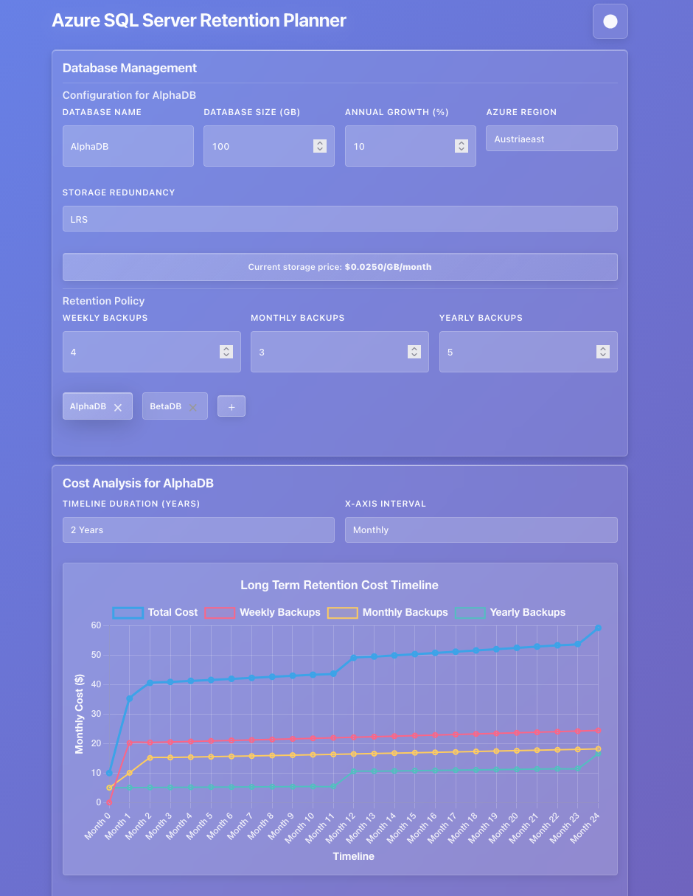

# Azure SQL Server Retention Planner

A simple price cost calculator for [Long-term retention backups](https://learn.microsoft.com/en-us/azure/azure-sql/database/long-term-retention-overview?view=azuresql) for Azure SQL. Allows you to easily visualise the cost of your LTR Backups!

**_ Obligatory disclaimer - these values are derived from [Azure SQL Database pricing](https://azure.microsoft.com/en-us/pricing/details/azure-sql-database/elastic/) and may differ in reality. Trust at your own risk! _**

Currently hosted on [azsqlretention.term.nz](azsqlretention.term.nz)

## Self-Hosting
